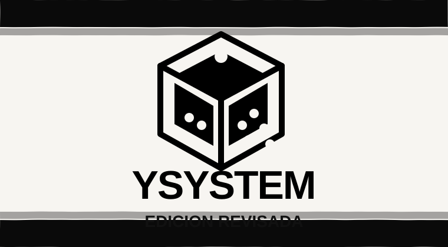
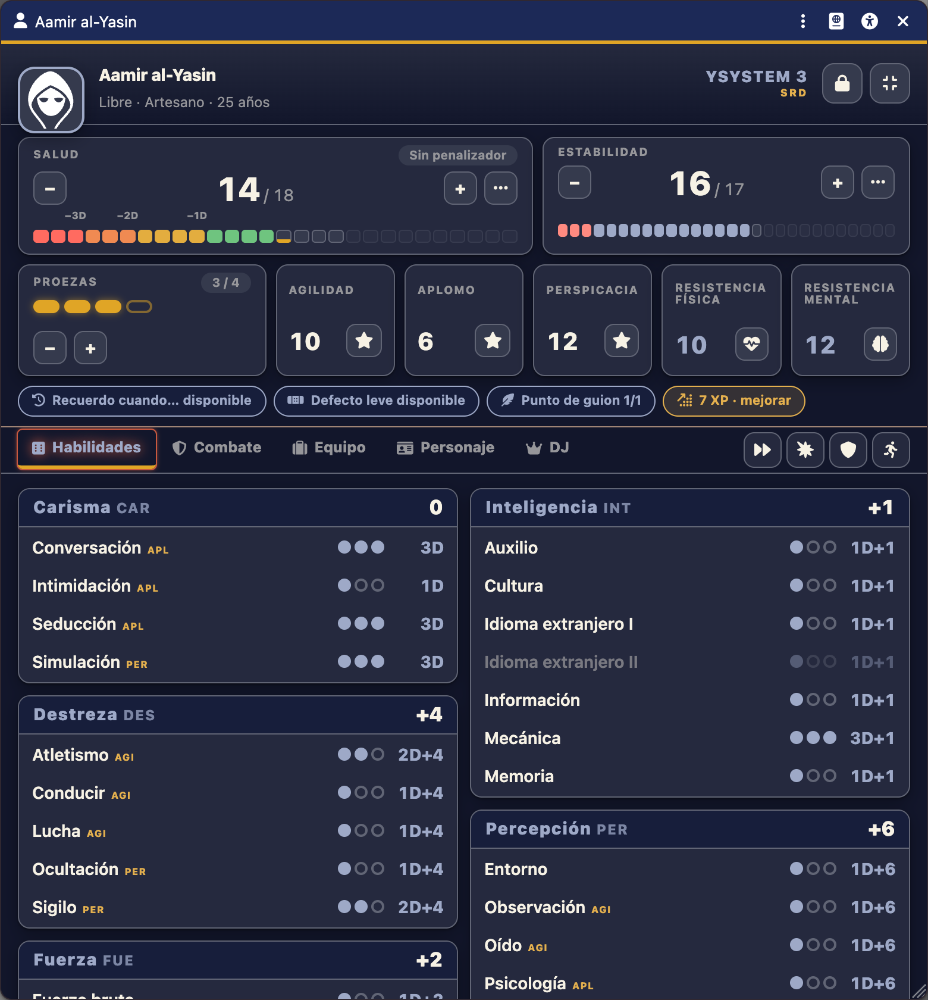
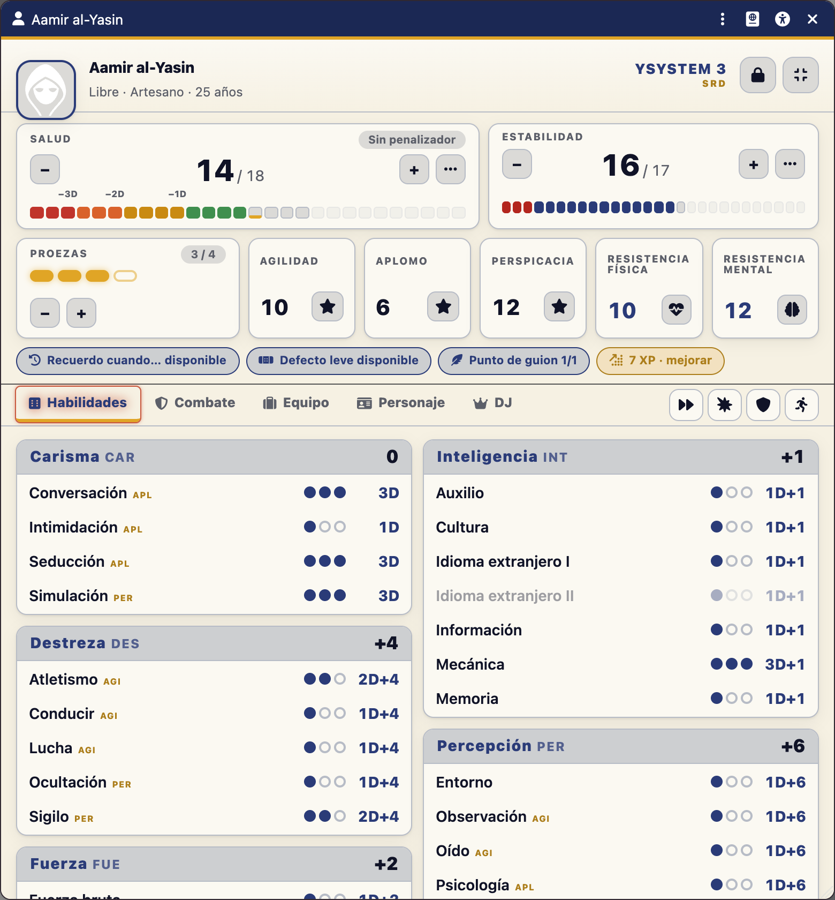
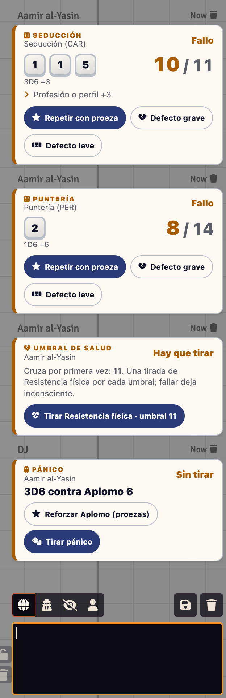
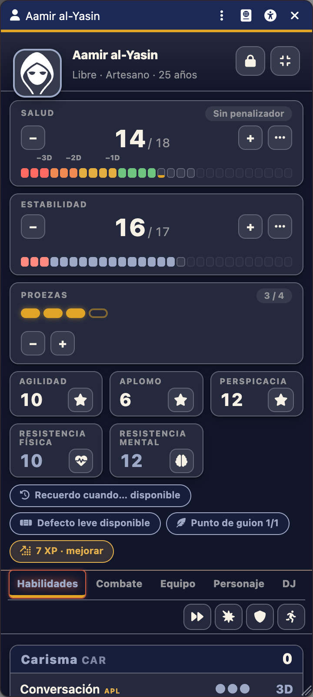
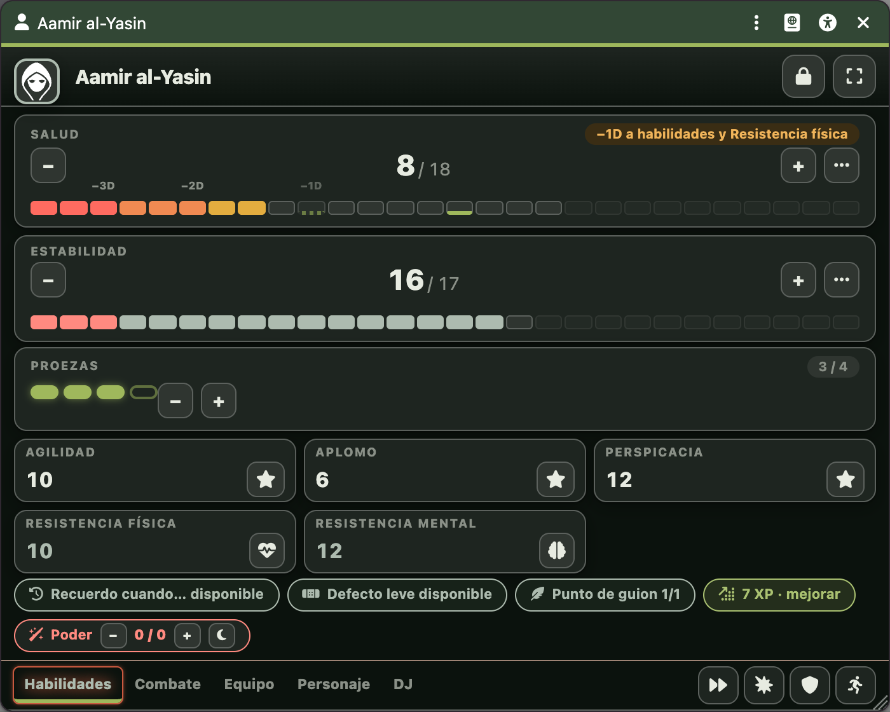
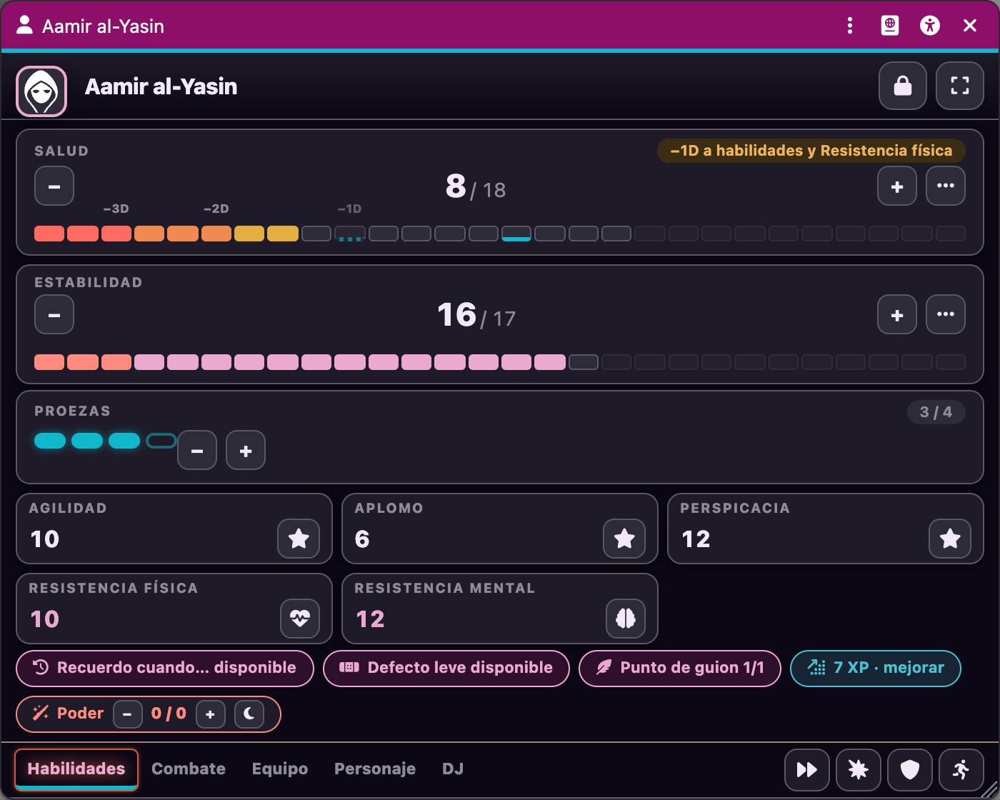
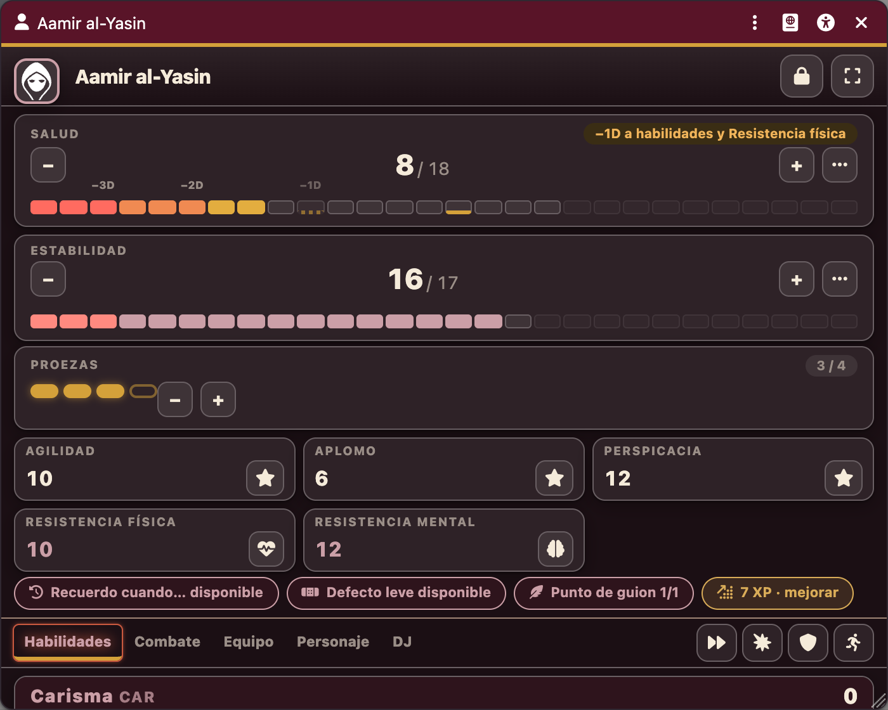
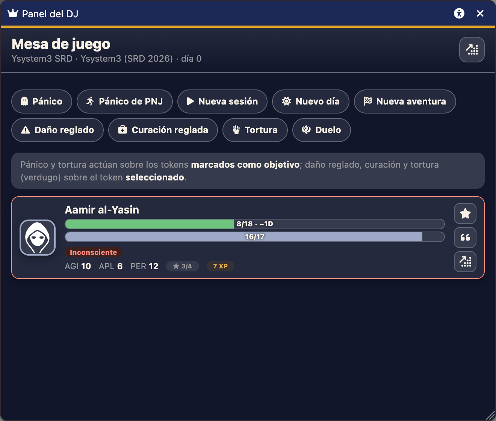

<div align="center">



# Ysystem3 SRD para Foundry VTT

**Todo el reglamento de Ysystem3 automatizado: proezas, defectos, Recuerdo cuando…, combate con ráfagas y noquear, Salud y Estabilidad con umbrales, pánico, persecuciones, curación, Experiencia y magia.**
Dos ediciones (Ysystem3 y Edición Revisada), nueve ambientaciones y el SRD completo en el compendio.

  <a href="https://github.com/ManuRomera/ysystem3-srd/releases/latest"></a>
  <a href="https://foundryvtt.com"></a>
  <a href="https://github.com/ManuRomera/ysystem3-srd/releases"></a>
  
  <a href="LICENSE.md"></a>

### [⬇️ Descargar la última versión](https://github.com/ManuRomera/ysystem3-srd/releases/latest) · [🌐 Web del proyecto](https://manuromera.github.io/ysystem3-srd/)

> ⚠️ **Sistema no oficial.** No está afiliado, aprobado ni publicado por Walhalla Ediciones.

</div>

---

## Instalar en 20 segundos

1. En Foundry: **Sistemas de juego → Instalar sistema**.
2. Pega esta URL en **URL del manifiesto** y pulsa **Instalar**:

```text
https://github.com/ManuRomera/ysystem3-srd/releases/latest/download/system.json
```

3. Crea un mundo con el sistema. Al crear tu primer PJ se abre el asistente. Foundry avisará de las actualizaciones.

> **¿Vienes de la 0.x?** Tu mundo sigue funcionando: las rutas de datos son las mismas y se migra solo al abrirlo. Si instalaste con la antigua URL de `main`, actualiza una vez con la de arriba.

---

## Una ficha pensada para jugar, no para rellenar

<p align="center">
  
  
</p>

- **Todo lo vital a la vista:** Salud y Estabilidad con barras por zonas (los umbrales de Resistencia marcados), proezas como pastillas, los tres valores fijos y las dos Resistencias en una sola fila.
- **Un clic = una tirada.** Las 24 habilidades por atributo, con dados, total y contra qué valor fijo se tiran. El diálogo suma profesión, proeza, Recuerdo cuando…, acciones combinadas, ayudas y oscuridad, y avisa del tope de 5D.
- **Claro y oscuro**, **modo compacto** (340 px) y **candado de edición**. Las ventanas recuerdan posición, tamaño, pestaña y modo.
- **Accesibilidad** en la cabecera de todas las ventanas y **encuadre del retrato**.

<p align="center">
  
  
  
</p>

## Las reglas, hechas por ti

| Del SRD | En Foundry |
|---|---|
| **Tirada** 1-3D + atributo, +3 profesión, tope 5D, dificultad del token marcado | Diálogo con todo; Agilidad, Aplomo o Perspicacia del objetivo, automáticos |
| **Críticos y pifias**, proeza por crítico | Tarjeta con dados, total y estado; sin críticos al repetir con proeza |
| **Proezas**: repetir dados, +1D, +3 a un valor fijo, +1D explosivo al daño, crítico en contra a fallo | Botones en la tarjeta; eliges qué dados repetir |
| **Defectos grave y leve** | Botones **solo para el DJ**: repite con −1D y da la proeza, o repite tal cual |
| **Recuerdo cuando…** y **punto de guion** | Interruptores en la ficha; «Vidas pasadas» y compañía |
| **Combate**: iniciativa, 6 = acción extra, sorpresa, desempate | Tracker con distintivos |
| **Atacar**: daño por tipo, apuntar, **noquear**, **ráfagas**, **cobertura**, desenfundar, ataques combinados, crítico | Un diálogo; el daño queda pendiente hasta «Aplicar» |
| **Defenderse completamente, inmovilizar, zafarse, huir** | Botones en la pestaña Combate |
| **Salud y Resistencia física**, umbrales 16-11-7-4-2 | Tarjeta con un botón por umbral cruzado |
| **Estabilidad, pánico, Resistencia mental, crisis de locura** | Tarjeta de pánico con refuerzo por proezas y duración de la crisis |
| **Otras fuentes de daño**, **curación**, **persecuciones** (tabla de sucesos de 2D) | Diálogos y tarjetas con estado |
| **Experiencia, aprendizaje, magia y poderes** | «Mejorar», Poder y habilidad de Magia/Psiónica |
| **Creación** libre, por plantilla o al azar; PNJ rápidos | Asistente con validación de las reglas del capítulo 7 |
| **Talentos** del SRD | 64 en el compendio, ~30 con efecto mecánico |

Cobertura completa y qué queda a decisión de la mesa: [`docs/AUDITORIA.md`](docs/AUDITORIA.md).

## Dos ediciones, nueve ambientaciones

En **Configuración → Ajustes del sistema**:

- **Edición:** *Ysystem3 (SRD 2026)* o *Edición Revisada (2023)*. Cambian el daño de las armas largas, los explosivos, la curación, el tope de 5D, el punto de guion y otras cifras.
- **Ambientación:** SRD base, **Anexo Pulp**, fantasía heroica, ciencia ficción, **horror lovecraftiano**, capa y espada, ciberpunk, terror contemporáneo, **IMSERSO to the Limit** y **Dungeons & Yayos**. Las dos últimas cambian de verdad las reglas (atributos, habilidades, Nervio/Bemoles, Jamacuco); las demás activan los *hacks* que el libro recomienda para cada género.

<p align="center">
  
  
  
</p>

## Para el DJ

El **Panel del DJ** (icono de corona) reúne a todos los PJ con su Salud, Estabilidad, proezas y estados, y las acciones de mesa: **pánico**, nueva sesión, nuevo día, nueva aventura, Experiencia, daño y curación reglados, **tortura** y **duelos**.

<p align="center"></p>

## Compendios

Reglas del SRD (los 8 capítulos, con atribución CC BY 4.0), 64 talentos, armas y protecciones de la tabla del SRD, plantillas de PJ, poderes, 4 PNJ de ejemplo, tablas (salvación ¡PULP!, sucesos de persecución) y macros.

## Para quien toque el código

```bash
npm ci
npm test        # reglas puras: cifras del SRD y de la Edición Revisada
npm run check   # sintaxis, rutas, plantillas, datos
npm run build   # compila los compendios a packs/ (cerrar Foundry antes)
```

`module/reglas.mjs` contiene todas las cifras del reglamento como funciones puras; el resto del sistema no conoce números. Publicar = subir la versión en `system.json`, `package.json` y `CHANGELOG.md` y empujar la etiqueta `vX.Y.Z`: GitHub Actions valida, compila y crea la release.

## Créditos y licencia

**Ysystem3** es obra de **Ignacio Sánchez Aranda** y **Jorge Carrero Roig**, publicado por **Walhalla Ediciones**. El [SRD](https://walhallaediciones.gitlab.io/ysystem/srd/) se distribuye bajo [CC BY 4.0](https://creativecommons.org/licenses/by/4.0/deed.es); este paquete reproduce y adapta parte de ese material (ver [`LICENSE.md`](LICENSE.md)). Código y recursos originales © 2026 Manu Romera, licencia MIT. IMSERSO to the Limit y Dungeons & Yayos pertenecen a sus autores.
